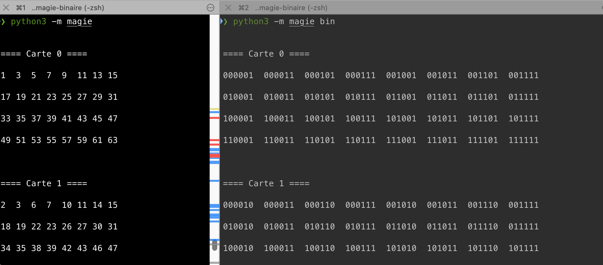

# magie-binaire

Une petite démonstration permettant de montrer la représentation binaire des cartes décrites dans l'activité [Magie Binaire](https://enseigner.modulo-info.ch/rep-info/activ/magie_binaire.html)

## Instructions de lancement

Il faut tout d'abord cloner le code source avec :

```sh
git clone git@github.com:Robb-Fr/magie-binaire.git
```

Ensuite, allez dans le dossier créé et nous vous conseillons de toujours créer un environnement virtuel Python et de l'activer avec les commandes suivantes :

```sh
cd magie-binaire; python3 -m venv venv; source venv/bin/activate
```

Enfin, vous n'avez plus qu'à lancer le module d'abord avec :

```sh
python3 -m magie
```

qui révélera les cartes en version décimale, puis :

```sh
python3 -m magie --bin
```

qui montrera la représentation binaire cachée.

